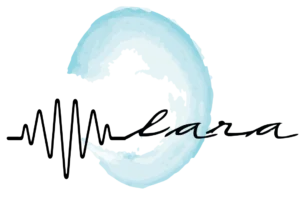

# Repositorio Pia/Mia
## Presentacion Personal

---

Soy *Manuel*, tengo 20 años y me gusta la informatica, aprender cosas nuevas del sector y estar siempre actualizado al mercado y las nuevas tecnologias.

El año pasado termine DAW en el IES Poligono Sur

Los lenguajes de programacion que mas conozco y en los que tengo mas experiencia son:

- Python
- Java Script

Otros lenguajes en los que he programado son:

- ABAP SAP
- Java

Tambien he trabajado con tecnologias como:
Docker, AWS, Git, SQL...

> Ademas participe en el apartado web de el proyecto PIA-LARA utilizando tecnologias como: Python, Flask, Mongo DB, Bootstrap.
[Proyecto LARA](https://github.com/PIALARA/pia-lara)

Sobre el curso, espero aprender mucho sobre Inteligencia Artificial y Big Data. Mi objetivo es aprender lo maximo posible en este curso y aprender tecnologias y metodologias que me ayuden en un futuro puesto de trabajo

---